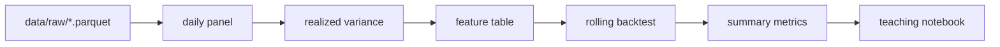

# Project Overview

## What This Project Does

This project studies one-day-ahead lower-tail Value-at-Risk, abbreviated VaR,
using an offline-first pipeline that starts from tracked raw minute-bar parquet
files.

The model set is deliberately narrow:

- Historical Simulation
- GARCH(1,1) with normal innovations
- GARCH(1,1) with Student-t innovations
- Filtered Historical Simulation
- Adaptive conformal lower-tail forecasting

## High-Level Flow



## Main Inputs and Outputs

### Inputs

- local raw parquet in `data/raw/`
- `config.toml` runtime settings

### Outputs

- `outputs/runs/daily_returns.parquet`
- `outputs/runs/daily_realized_variance.parquet`
- `outputs/runs/feature_table.parquet`
- `outputs/runs/backtest_results.parquet`
- `outputs/runs/summary_metrics.parquet`

## Architecture Notes

- The runtime path is local-parquet-only by default.
- ClickHouse is optional and only documented for one-time raw-cache refresh.
- The feature layer is small and explicitly no-lookahead.
- The notebook is a full teaching walkthrough, not a dashboard artifact reader.

## File Tree

```text
scripts/
└── run_pipeline.py
src/
├── GUIDE_src.md
└── conformal_var_risk/
    ├── config.py
    ├── data/
    │   ├── raw_cache.py
    │   ├── daily_panel.py
    │   └── realized_variance.py
    ├── features/
    │   └── feature_builder.py
    ├── models/
    ├── evaluation/
    └── pipeline/
        └── run.py
tests/
└── unit/
```
