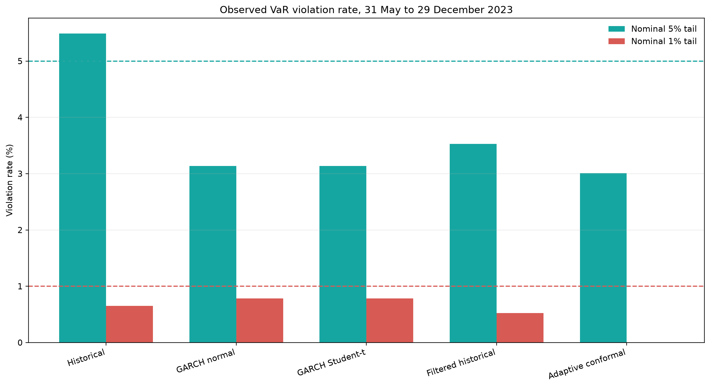
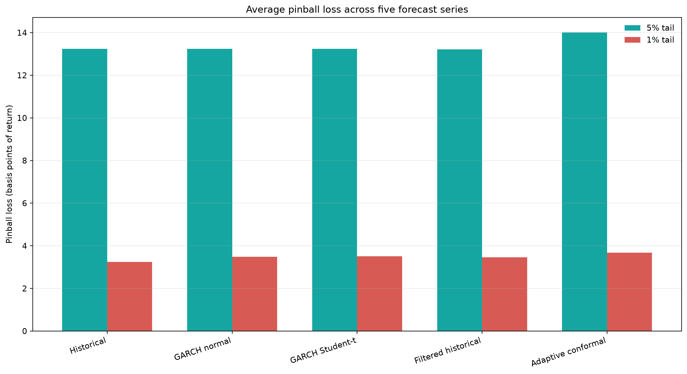

Une prévision de Value-at-Risk à un jour trace une limite. Si le modèle annonce une borne de queue gauche à 5 %, les rendements devraient la franchir environ cinq jours sur cent. Trop de franchissements indiquent un risque sous-estimé. Aucun franchissement peut sembler rassurant, mais une borne trop large perd vite son utilité pour fixer une limite de trading ou décider d'un montant de capital.

J'ai construit ce projet pour mesurer ce compromis. L'expérience compare la prédiction conforme adaptative à quatre benchmarks, avec les mêmes données et les mêmes dates de prévision walk-forward. Le résultat ne se résume pas à un classement : sur cet échantillon, la méthode conforme s'est montrée prudente, au prix d'une perte pinball plus élevée.


L'image résume le problème : des observations peuvent traverser une limite de risque, puis une règle adaptative déplace cette limite après l'erreur. Il reste à mesurer si cette protection supplémentaire justifie une borne plus large.

## Une prévision honnête commence par une horloge honnête

Les données suivies dans le dépôt contiennent les barres d'une minute en séance régulière pour AAPL, JPM, TSLA et SPY, de 2019 à 2023. Le pipeline prend le dernier cours de chaque séance et calcule les rendements logarithmiques quotidiens. Si $P_t$ est le cours de clôture au jour $t$ et $P_{t-1}$ le cours précédent, le rendement vaut

$$
r_t = \log\left(\frac{P_t}{P_{t-1}}\right).
$$

Ici, $r_t$ est un rendement quotidien en valeur décimale. Le pipeline calcule aussi la variance réalisée à partir des rendements intrajournaliers et décale les variables explicatives dans le temps. Ces variables préparent la table de recherche pour de futurs modèles, même si les cinq modèles comparés ici utilisent directement l'historique des rendements quotidiens.

Chaque prévision respecte le même ordre : ajustement sur 1 150 observations passées, prévision du lendemain, enregistrement du rendement réalisé, puis mise à jour du modèle. Cette séquence est décisive. Le rendement réalisé ne peut pas influencer la borne qui sert à l'évaluer.

```python
training_returns = asset_series.iloc[
    evaluation_index - calibration_window : evaluation_index
].to_numpy(dtype=float)
realized_return = float(asset_series.iloc[evaluation_index])

model.fit(training_returns)
lower_quantile = min(model.predict_lower_quantile(alpha=alpha), 0.0)
is_violation = realized_return < lower_quantile
model.observe(realized_return=realized_return, alpha=alpha)
```

Les quatre actifs et un portefeuille équipondéré donnent cinq séries de prévisions. Chacune est évaluée aux probabilités de queue de 5 % et 1 % avec cinq méthodes : simulation historique, GARCH(1,1) gaussien, GARCH(1,1) de Student, simulation historique filtrée et VaR conforme adaptative. GARCH signifie « hétéroscédasticité conditionnelle autorégressive généralisée » : la variance conditionnelle varie dans le temps.

## Construire la borne conforme

Le modèle conforme part d'une moyenne mobile. Soit $m=20$ la fenêtre de calcul et $\hat{\mu}_t$ le centre prévu pour le jour $t$ :

$$
\hat{\mu}_t = \frac{1}{m}\sum_{j=1}^{m} r_{t-j}.
$$

Pour chaque observation de calibration, le modèle ne garde que les erreurs du côté des pertes. Le score de non-conformité unilatéral est

$$
s_t = \max(\hat{\mu}_t-r_t,0),
$$

où $s_t$ mesure l'écart entre le rendement et son centre mobile lorsqu'il est négatif, et vaut zéro dans le cas contraire. En notant $Q_p(s)$ le quantile empirique d'ordre $p$ des scores récents et $a_t$ le niveau de queue interne du modèle, le prochain quantile inférieur est

$$
q_t(a_t)=\hat{\mu}_t-Q_{1-a_t}(s).
$$

La Value-at-Risk (VaR) publiée est une perte positive :

$$
\operatorname{VaR}_{t,\alpha}=\max(-q_t(a_t),0),
$$

où $\alpha$ est la probabilité de queue visée. Il y a violation lorsque $r_t<q_t(a_t)$.

Après l'observation du jour $t$, la règle adaptative modifie le niveau de queue interne. Soit $I_t=1$ après une violation et $I_t=0$ sinon, et soit $\gamma=0.005$ le taux d'apprentissage. L'implémentation applique

$$
a_{t+1}=\operatorname{clip}\left(a_t+\gamma(\alpha-I_t),0.001,0.999\right).
$$

Une violation diminue donc $a_t$, sélectionne un quantile de score plus élevé et abaisse la borne suivante. Une journée calme augmente progressivement $a_t$. Le modèle réagit au sens de la dernière erreur de couverture sans imposer de loi paramétrique aux rendements.

```python
raw_shortfalls = rolling_centers - realized_segment
self._scores = np.maximum(raw_shortfalls, 0.0)

adjustment = np.quantile(self._scores, 1.0 - self.current_alpha)
lower_quantile = self._center - adjustment

breach = float(realized_return < self._last_lower_quantile)
self.current_alpha += self.learning_rate * (self._target_alpha - breach)
```

## Calibration et précision ne répondent pas à la même question

La fenêtre d'évaluation disponible va du 31 mai au 29 décembre 2023. Elle contient 153 prévisions par actif ou portefeuille, soit 765 prévisions par modèle et niveau de queue. Le volume suffit pour une comparaison compacte, mais reste faible pour un événement à 1 % : après regroupement des cinq séries, le nombre attendu de violations n'est que de 7,65.



La simulation historique est la plus proche de la cible de 5 %, avec 42 violations et un taux agrégé de 5,49 %. La méthode conforme adaptative en compte 23, soit 3,01 %. Au niveau de 1 %, la méthode conforme n'en compte aucune, contre cinq pour la simulation historique. Les lignes pointillées indiquent les cibles nominales. Rester sous la ligne n'est pas gratuit : si l'échantillon est représentatif, cela signifie que la limite de risque était plus large que nécessaire.

| Modèle | Violations à 5 % | Taux à 5 % | Violations à 1 % | Taux à 1 % |
|---|---:|---:|---:|---:|
| Simulation historique | 42 | 5.49% | 5 | 0.65% |
| GARCH gaussien | 24 | 3.14% | 6 | 0.78% |
| GARCH de Student | 24 | 3.14% | 6 | 0.78% |
| Simulation historique filtrée | 27 | 3.53% | 4 | 0.52% |
| Conforme adaptative | 23 | 3.01% | 0 | 0.00% |

Pour chaque paire modèle-niveau de queue, les cinq tests de couverture inconditionnelle et conditionnelle de Christoffersen par actif ont une p-value supérieure à 5 %. Cela ne prouve pas que tous les modèles sont bien calibrés. Avec 153 observations par série, ces tests ont peu de puissance dans la queue à 1 %. Ne pas rejeter une hypothèse est moins convaincant qu'une preuve positive de bonne couverture.

La perte pinball rend visible le coût de la prudence. Pour le rendement réalisé $r_t$, le quantile prévu $q_t$ et l'indicateur de violation $I_t$, elle vaut

$$
L_{\alpha}(r_t,q_t)=(\alpha-I_t)(r_t-q_t).
$$

Elle pénalise une borne trop haute lorsqu'une perte la franchit, mais facture aussi les prévisions inutilement éloignées des rendements ordinaires.



À 5 %, la simulation historique filtrée obtient la perte moyenne la plus faible, soit 13,21 points de base de rendement ; la méthode conforme adaptative affiche la plus élevée, à 14,01. À 1 %, la simulation historique arrive en tête avec 3,24 points de base, contre 3,68 pour la méthode conforme. L'écart reste modeste, mais l'ordre correspond au graphique des violations : la méthode conforme a acheté moins de franchissements avec une borne plus prudente.

## Regarder une borne évoluer

La trajectoire de SPY montre mieux la mécanique. La ligne turquoise est le quantile de rendement conforme adaptatif à 5 %, la ligne grise le rendement logarithmique quotidien réalisé et les points rouges les violations.

SPY a franchi la borne conforme adaptative à 5 % cinq fois sur 153 prévisions, soit un taux de 3,27 %. Le quantile inférieur est plus lisse que le rendement quotidien, car il repose sur un centre à 20 jours et une fenêtre de 500 scores. Après une violation, la mise à jour interne rend la prévision suivante plus prudente ; les observations calmes inversent lentement ce mouvement.

## Ce que je changerais avant une utilisation réelle

La calibration sur 1 150 jours ne laisse que sept mois de données pour l'évaluation. Elle exclut aussi des résultats toutes les fenêtres configurées pour la crise du COVID et le choc de taux de 2022, puisque ces dates précèdent la première prévision. Une véritable comparaison en période de stress demanderait un historique brut plus long ou une fenêtre de calibration plus courte, justifiée hors échantillon.

L'état adaptatif mérite également une analyse de sensibilité. Le taux d'apprentissage $\gamma=0.005$ est élevé par rapport à une cible de 1 %, et le bornage peut compter après plusieurs violations rapprochées. Avant de conclure que la mise à jour réagit mieux aux changements de régime, je tracerais $a_t$, testerais plusieurs taux d'apprentissage et comparerais la couverture glissante.

L'Expected Shortfall (ES), c'est-à-dire la perte moyenne conditionnelle dans la queue, reste ici un diagnostic empirique secondaire. La construction conforme cible un quantile ; elle ne donne pas de garantie formelle sur l'ES. Cette distinction doit rester explicite dans une présentation destinée à la production.

La leçon tient dans la méthode d'évaluation. Couverture, précision et taille d'échantillon doivent être examinées ensemble. Sur cette période, la VaR conforme adaptative a réduit le nombre de violations, tandis que les méthodes historique et historique filtrée ont obtenu une meilleure perte quantile. Avant de choisir la borne, un risk manager doit décider combien de largeur supplémentaire il accepte de payer.
