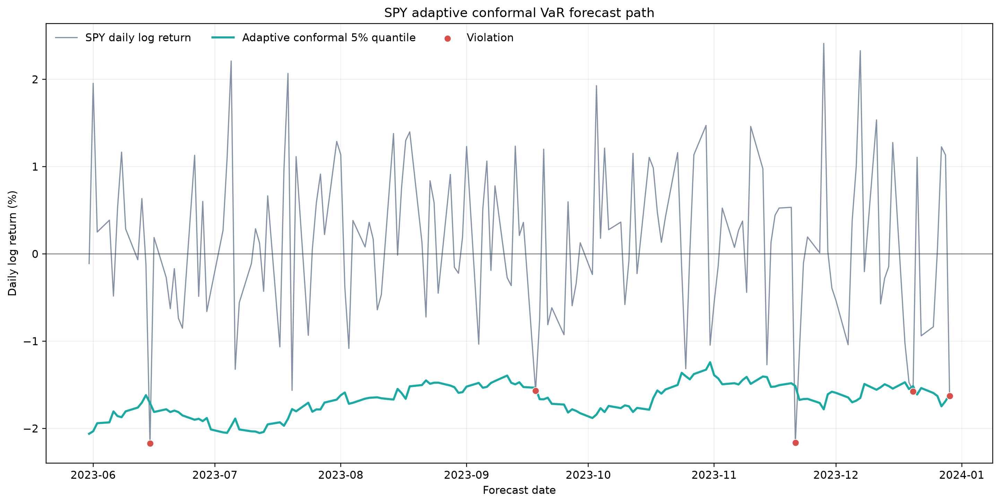

A one-day Value at Risk forecast draws a boundary under tomorrow's return. If the model targets a 5% lower tail, roughly five returns in one hundred should fall below that boundary over a long, stable evaluation period. Too many crossings mean the model understates risk. Too few may look reassuring, but capital and trading limits become needlessly expensive when the boundary is too low.

This project compares an adaptive conformal forecast with four standard market-risk models. Every model sees the same trailing returns and predicts the same dates. The conformal forecast produced fewer breaches in this sample, but it also had the worst quantile loss. That is the trade-off worth studying.

## Defining the object being forecast

Let $P_t$ be an asset's closing price on trading day $t$. Its one-day log return, measured in decimal return units, is

$$
r_t = \log\left(\frac{P_t}{P_{t-1}}\right).
$$

Let $q_{t,\alpha}$ be the forecast $alpha$-quantile of $r_t$, where $\alpha=0.05$ means the lower 5% tail. The model expects

$$
\Pr(r_t < q_{t,\alpha}) \approx \alpha.
$$

Value at Risk (VaR) converts this return boundary into a nonnegative loss number:

$$
\operatorname{VaR}_{t,\alpha}=\max(-q_{t,\alpha},0).
$$

For example, $q_{t,0.05}=-0.02$ implies a 2% one-day VaR. A violation, also called an exceedance, occurs when the realized return satisfies $r_t<q_{t,\alpha}$. The backtest scores the raw return quantile, even in the unusual case where it is positive; truncation applies only when VaR is displayed as a loss.

## From minute bars to one forecast clock

The tracked dataset contains regular-session minute bars for AAPL, JPM, TSLA, and SPY from 2019 through 2023. The pipeline takes the last regular-session close for each date, builds daily log returns, and forms an equal-weight portfolio series.

It also computes realized variance from synchronized intraday returns. Let $r_{t,i,j}$ be constituent $j$'s intraday log return during interval $i$ on date $t$, and let $N=4$ be the number of constituents. The equal-weight intraday portfolio return is

$$
r^{p}_{t,i}=\frac{1}{N}\sum_{j=1}^{N}r_{t,i,j}.
$$

Daily portfolio realized variance, in squared decimal-return units per day, is then

$$
\operatorname{RV}^{p}_t=\sum_i\left(r^{p}_{t,i}\right)^2
=\frac{1}{N^2}\sum_i\sum_{j=1}^{N}\sum_{k=1}^{N}r_{t,i,j}r_{t,i,k}.
$$

The index $k$ identifies a second constituent, so cross-products with $j\ne k$ carry intraday covariance. An earlier implementation averaged constituent realized variances, which omitted those terms and applied the wrong weight scaling. The corrected pipeline computes the portfolio return first and squares it second. These realized-variance features are lagged and available for extensions; the five models tested here fit trailing daily returns directly.

The walk-forward order is strict. For each forecast date, the model fits on the preceding 1,150 returns, predicts the next return, records the outcome, and only then updates adaptive state.

```python
training_returns = asset_series.iloc[
    evaluation_index - calibration_window : evaluation_index
].to_numpy(dtype=float)
realized_return = float(asset_series.iloc[evaluation_index])

model.fit(training_returns)
lower_quantile = model.predict_lower_quantile(alpha=alpha)
is_violation = realized_return < lower_quantile
model.observe(realized_return=realized_return, alpha=alpha)
```

Nothing observed on day $t$ enters the boundary used to judge day $t$.

## What the five models assume

Historical simulation takes the empirical $\alpha$-quantile of the latest 250 returns. It assumes the recent empirical distribution is relevant for tomorrow.

The generalized autoregressive conditional heteroskedasticity model, abbreviated GARCH, makes volatility time-varying. For GARCH(1,1), let $\mu_t$ be the conditional mean, $\varepsilon_t=r_t-\mu_t$ the return shock, and $\sigma_t^2$ the conditional variance. The recursion is

$$
\sigma_{t+1}^2=\omega+\beta\sigma_t^2+\delta\varepsilon_t^2,
$$

where $\omega>0$, $\beta\ge 0$, and $\delta\ge 0$ are estimated parameters. If $F^{-1}(\alpha)$ is the lower-tail quantile of the standardized innovation distribution, then

$$
q_{t+1,\alpha}=\mu_{t+1}+\sigma_{t+1}F^{-1}(\alpha).
$$

The comparison includes Gaussian and Student-$t$ innovations. The Student-$t$ law permits heavier tails.

Filtered historical simulation also fits GARCH, but resamples empirical standardized shocks instead of imposing a Gaussian or Student-$t$ tail. It combines a parametric volatility forecast with a nonparametric shock distribution.

## Constructing the adaptive conformal boundary

The conformal model starts with a rolling mean. Let $m=20$ be the mean window and let $\hat{\mu}_u$ be the center predicted for calibration date $u$:

$$
\hat{\mu}_u=\frac{1}{m}\sum_{j=1}^{m}r_{u-j}.
$$

Its one-sided nonconformity score keeps only downside forecast errors:

$$
s_u=\max(\hat{\mu}_u-r_u,0).
$$

The conformal window contains 500 returns, leaving $n=500-20=480$ scores after the rolling-mean warm-up. Sort them as $s_{(1)}\le\cdots\le s_{(n)}$. If $a_t$ is the model's current internal tail probability, the finite-sample corrected rank is

$$
k_t=\min\left(n,\left\lceil(n+1)(1-a_t)\right\rceil\right).
$$

The next lower return boundary is

$$
q_{t,\alpha}=\hat{\mu}_t-s_{(k_t)}.
$$

The $n+1$ correction selects an observed order statistic instead of an interpolated percentile. It is the usual split-conformal rank correction. It does not create an unconditional finite-sample guarantee for this experiment: overlapping rolling scores and serially dependent financial returns do not satisfy the exchangeability assumption used by classical conformal theory.

```python
sample_size = len(scores)
rank = int(np.ceil((sample_size + 1) * (1.0 - alpha)))
clipped_rank = int(np.clip(rank, 1, sample_size))
adjustment = np.partition(scores, clipped_rank - 1)[clipped_rank - 1]
lower_quantile = center - adjustment
```

Adaptation changes $a_t$ after each outcome. Define $I_t=1$ for a violation and $I_t=0$ otherwise. With target tail probability $\alpha$ and learning rate $\gamma=0.005$, the update is

$$
a_{t+1}=\operatorname{clip}\left(a_t+\gamma(\alpha-I_t),0.001,0.999\right).
$$

A breach makes $\alpha-I_t<0$, so $a_{t+1}$ falls. The rank $k_{t+1}$ rises, the selected score gets larger, and the next boundary moves down. Quiet days reverse that movement in increments of $\gamma\alpha$.

This is an adaptive conformal-inspired risk rule, not a claim that equity returns are distribution-free in the everyday sense. The formal result in Gibbs and Candès controls long-run miscoverage under conditions described in their paper; this seven-month backtest still has to earn its conclusions empirically.

## Scoring calibration and usefulness

The empirical violation rate for $T$ forecasts is

$$
\hat{p}=\frac{1}{T}\sum_{t=1}^{T}I_t.
$$

Let $K=\sum_{t=1}^{T}I_t$ be the number of violations. Under a constant violation probability $p$, the Bernoulli likelihood is

$$
\mathcal{L}(p)=p^K(1-p)^{T-K}.
$$

Calibration asks whether $\hat{p}$ is compatible with $\alpha$. Let $\operatorname{LR}_{\mathrm{UC}}$ denote Christoffersen's likelihood-ratio statistic for unconditional coverage:

$$
\operatorname{LR}_{\mathrm{UC}}=-2\log\left(\frac{\mathcal{L}(\alpha)}{\mathcal{L}(\hat{p})}\right),
$$

which has an asymptotic chi-squared reference distribution with one degree of freedom under the null. Conditional coverage adds a first-order transition test to detect clustered violations. A p-value above 5% means the sample did not reject the model; it does not prove correct calibration.

Quantile, or pinball, loss measures usefulness as well as breach frequency. Write $q_t=q_{t,\alpha}$ for the predicted lower quantile:

$$
L_{\alpha}(r_t,q_t)=(\alpha-I_t)(r_t-q_t).
$$

The two cases show its economics. When $r_t\ge q_t$, $I_t=0$ and the cost is $\alpha(r_t-q_t)$. When $r_t<q_t$, the cost is $(1-\alpha)(q_t-r_t)$. A very low boundary avoids breaches but pays a small cost on nearly every ordinary day.

## Results: conservative, but not sharper

The 1,150-day calibration window leaves 153 forecasts per series, from 31 May through 29 December 2023. The pooled counts below combine four assets and the portfolio for a descriptive total of 765 forecasts. They are not 765 independent trials because the assets and portfolio share market shocks.


The dashed lines mark the nominal tail probabilities. Bars below them identify conservative forecasts in this sample, not automatically better forecasts.

| Model | 5% violations | 5% rate | 1% violations | 1% rate |
|---|---:|---:|---:|---:|
| Historical simulation | 42 | 5.49% | 5 | 0.65% |
| Gaussian GARCH | 24 | 3.14% | 6 | 0.78% |
| Student-t GARCH | 24 | 3.14% | 6 | 0.78% |
| Filtered historical simulation | 27 | 3.53% | 4 | 0.52% |
| Adaptive conformal | 22 | 2.88% | 0 | 0.00% |

Historical simulation landed closest to the pooled 5% target. Adaptive conformal produced the fewest breaches and the widest average VaR: 2.48% at the 5% tail and 3.74% at the 1% tail. Lower breach counts therefore came with more capital width.

The sample has little power at 1%. For one series, $T=153$ and the expected number of breaches under correct calibration is $T\alpha=1.53$. The probability of seeing none is

$$
\Pr(K=0\mid T=153,\alpha=0.01)=(1-\alpha)^T=0.99^{153}=21.49\%.
$$

Zero breaches are not surprising under the null. Under the binomial independence assumption, the exact 95% Clopper-Pearson interval for a zero-of-153 breach rate runs from 0% to 2.38%, which contains the 1% target. Every asset-level Christoffersen p-value also exceeded 5%, but the same short sample limits those tests.


At 5%, filtered historical simulation had the lowest average pinball loss at 13.21 basis points of return. Adaptive conformal had the highest at 14.09 basis points. At 1%, historical simulation led at 3.24 basis points, compared with 3.84 for adaptive conformal. The breach chart alone favors conservatism; pinball loss shows what that conservatism cost.



SPY crossed the 5% conformal boundary five times in 153 forecasts, a 3.27% rate. Its exact 95% breach-rate interval is 1.07% to 7.46%. The teal boundary moves slowly because it combines a 20-day center, 480 calibration scores, and the adaptive update. Red points identify the dates that push the internal tail probability downward.

## What the experiment can and cannot support

The configured COVID and 2022 rate-shock periods produce no out-of-sample rows: both end before the first forecast in May 2023. Calling them stress tests would be wrong. A credible stress comparison needs more pre-2019 history or a shorter calibration window chosen without looking at the test results.

The five forecast series are cross-sectionally dependent, so pooled breach totals are visualization aids rather than formal sample-size multiplication. Coverage inference belongs at the series level or in a method that models the dependence.

The learning rate also needs sensitivity analysis. At the 1% target, one quiet day raises $a_t$ by only $0.00005$, while one breach lowers it by $0.00495$. That asymmetry is intentional, but a seven-month path cannot establish how it behaves across several volatility regimes.

Expected Shortfall (ES) is the mean loss conditional on entering the tail. The project reports it as a secondary empirical diagnostic, but the conformal score targets a quantile, not ES. No conformal ES guarantee follows from this construction.

The result is useful precisely because it is not a win for the new method. Adaptive conformal VaR reduced violations during these 153 dates, then lost on quantile loss. With the sample this short, the defensible conclusion is narrower: the update changed the calibration-sharpness trade-off, and a longer evaluation is needed to decide whether the extra width pays for itself.

## References

- Gibbs, I. and Candès, E. (2021), [Adaptive Conformal Inference Under Distribution Shift](https://proceedings.neurips.cc/paper/2021/hash/0d441de75945e5acbc865406fc9a2559-Abstract.html).
- Christoffersen, P. (1998), [Evaluating Interval Forecasts](https://www.jstor.org/stable/2527341).
- Bollerslev, T. (1986), [Generalized Autoregressive Conditional Heteroskedasticity](https://doi.org/10.1016/0304-4076(86)90063-1).
- Barone-Adesi, G., Giannopoulos, K. and Vosper, L. (1999), [VaR without Correlations for Portfolios of Derivative Securities](https://doi.org/10.1002/(SICI)1096-9934(199908)19:5%3C583::AID-FUT5%3E3.0.CO;2-S).
- Koenker, R. and Bassett, G. (1978), [Regression Quantiles](https://www.jstor.org/stable/1913643).
- Andersen, T., Bollerslev, T., Diebold, F. and Labys, P. (2003), [Modeling and Forecasting Realized Volatility](https://doi.org/10.1111/1468-0262.00418).
- Basel Committee on Banking Supervision (2019), [Minimum capital requirements for market risk](https://www.bis.org/bcbs/publ/d457.htm).
